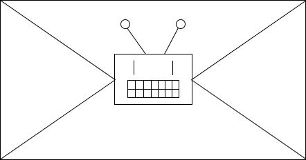
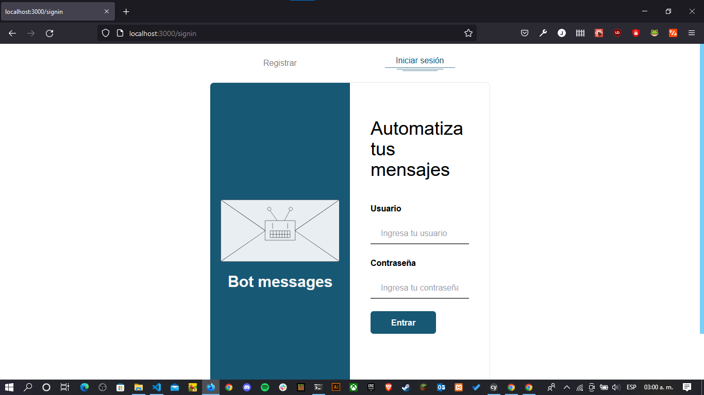
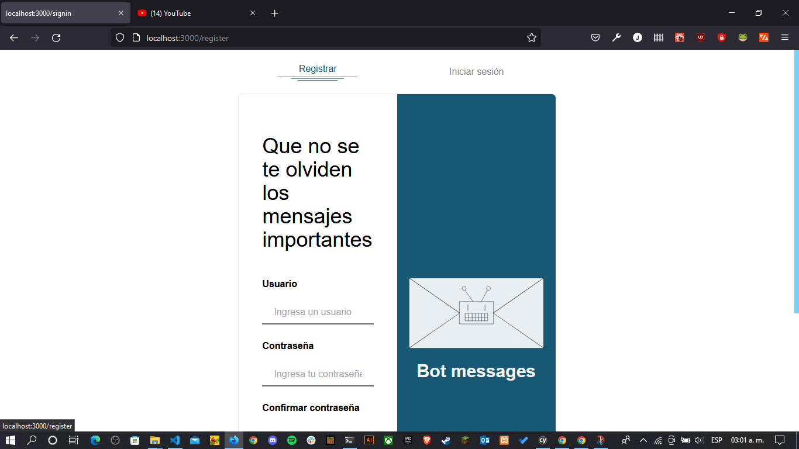
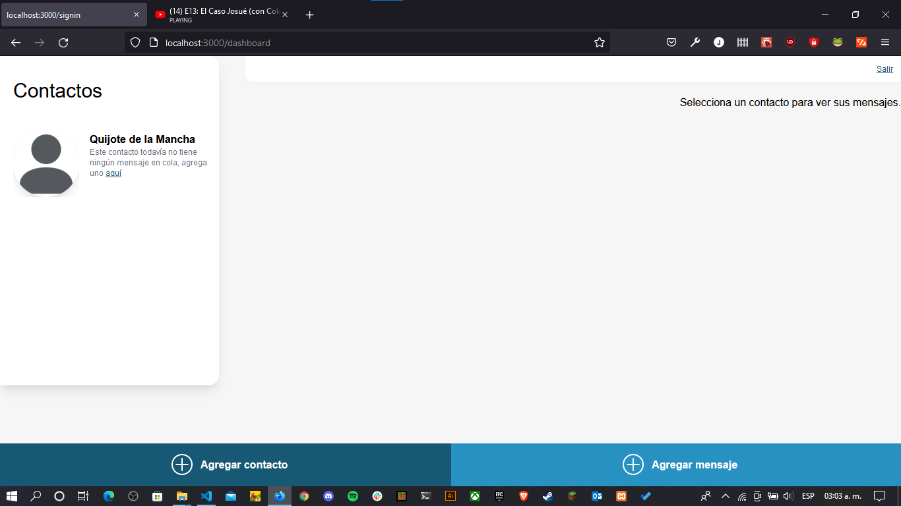
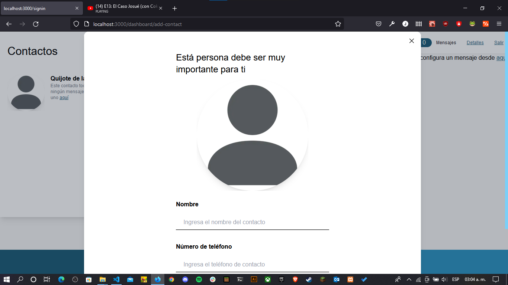
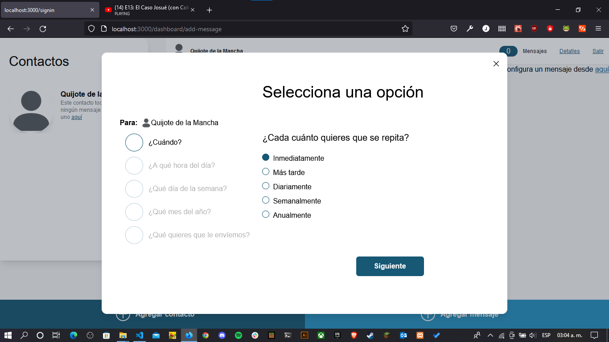
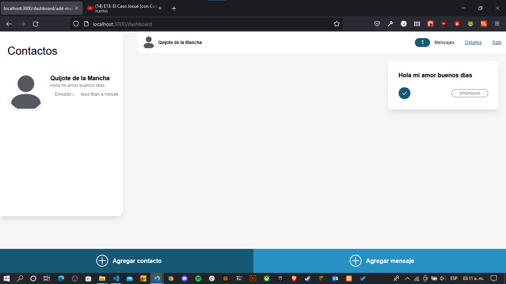

# Bot messages



[Figma mockup](https://www.figma.com/file/304GNIThYn4jwf7jPY0B0P/Bot-messages)

## Requirements

#### Node.js v.14.x or higher
### NPM v.7.x or higher (workspaces support)

## Frameworks and libraries

#### Typescript (v.4.x)
#### React (v.18.x)
#### Next.js (v.12.x)
#### TailwindCSS (v.3.x)
#### Sequelize (v.6.x)
#### Express (v.4.x)
#### React-Query (v.3.x)

## Screenshots








## Install packages

```bash
 npm install
```

## Build shared packages

Make this before run servers

```bash
 npm run build:shared
```

## Start next server

```bash
 npm run start:next-dev
```

## Start Database server

```bash
 npm run start:database-server-dev
```
